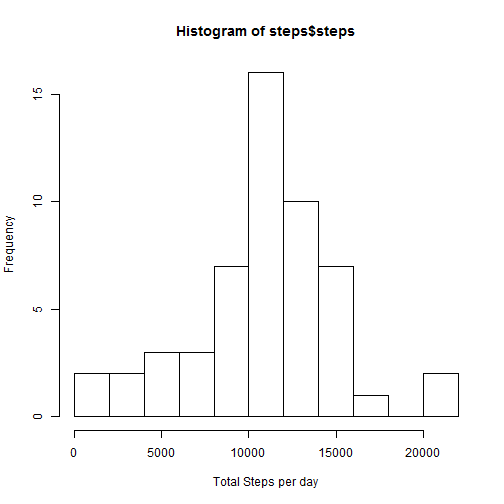
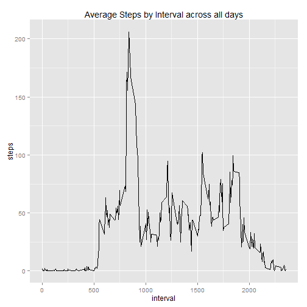
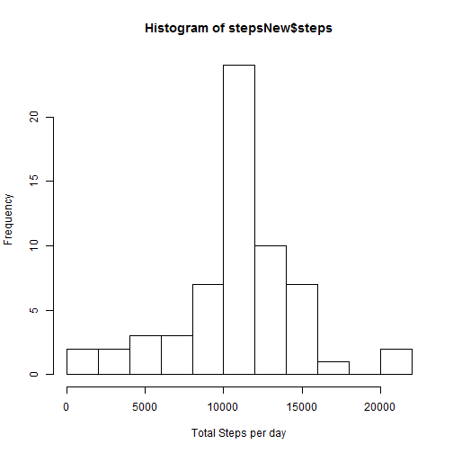
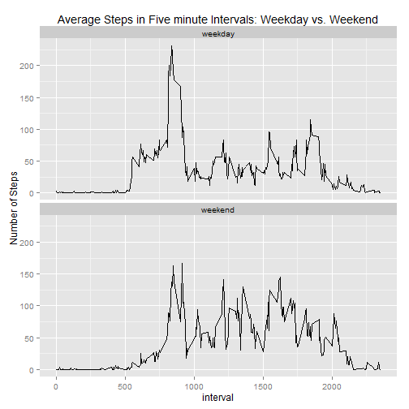

Pear Assessment One

Load and process data

setwd("~/Johns Hopkins/Reproducible Research/Assignment One/Data")


```r
activity<-read.csv("activity.csv", header=TRUE)
activity$date<-as.Date(activity$date)
stepsNoNA<-na.omit(activity)
```

What is mean total number of steps taken per day?


Calculate the total number of steps taken per day

```r
steps<-aggregate(steps~date, data=stepsNoNA, FUN=sum)
```

histogram of total number of steps taken per day

```r
hist(steps$steps, xlab="Total Steps per day", breaks=10)
```

 

Mean and median of the total number of steps taken per day

```r
mean(steps$steps)
```

```
## [1] 10766.19
```


```r
median(steps$steps)
```

```
## [1] 10765
```

What is the average daily activity pattern?

Make a time series plot (i.e. type = "l") of the 5-minute interval (x-axis) and the average number of steps taken, averaged across all days (y-axis)


```r
library(ggplot2)

stepsinterval<-aggregate(steps~interval, data=stepsNoNA, FUN=mean)

stepsinterplot<- ggplot(stepsinterval, aes(x=interval, y = steps)) + geom_line(stat="identity")

stepsinterplot + ggtitle("Average Steps by Interval across all days")
```

 

Which 5-minute interval, on average across all the days in the dataset, contains the maximum number of steps?


```r
stepsinterval$interval[which.max(stepsinterval$steps)]
```

```
## [1] 835
```

Imputing missing values

Calculate and report the total number of missing values in the dataset (i.e. the total number of rows with NAs)


```r
sum(is.na(activity))
```

```
## [1] 2304
```

Devise a strategy for filling in all of the missing values in the dataset. The strategy does not need to be sophisticated. For example, you could use the mean/median for that day, or the mean for that 5-minute interval, etc.

Create a new dataset that is equal to the original dataset but with the missing data completed.


```r
stepsonly<-data.frame(activity$steps)
stepsonly[is.na(stepsonly),]<- (tapply(X=activity$steps,INDEX=activity$interval,FUN=mean,na.rm=TRUE))
sum(is.na(stepsonly))
```

```
## [1] 0
```

```r
stepsonly<-ceiling(stepsonly)  ## used ceiling in place of round
activityNoNA<- cbind(stepsonly, activity[,2:3])
sum(is.na(activityNoNA))
```

```
## [1] 0
```

```r
colnames(activityNoNA)<- c("steps","date","interval")  ## rename columns for ease of reference
stepsNew<-aggregate(steps~date, data=activityNoNA, FUN=sum)
```

Make a histogram of the total number of steps taken each day and Calculate and report the mean and median total number 
of steps taken per day. Do these values differ from the estimates from the first part of the assignment? What is the impact of imputing missing data on the estimates of the total daily number of steps?


```r
hist(stepsNew$steps, xlab="Total Steps per day", breaks=10)
```

 

```r
mean(stepsNew$steps)
```

```
## [1] 10784.92
```

```r
median(stepsNew$steps)
```

```
## [1] 10909
```

```r
meandiff<-mean(steps$steps)-mean(stepsNew$steps)

mediandiff<-median(stepsNew$steps)-median(steps$steps)

meandiff
```

```
## [1] -18.72935
```

```r
mediandiff
```

```
## [1] 144
```

Are there differences in activity patterns between weekdays and weekends?

Create a new factor variable in the dataset with two levels - "weekday" and "weekend" indicating whether a given date is a weekday or weekend day.


```r
activityNoNA$day[weekdays(as.Date(activityNoNA$date)) %in% c("Saturday", "Sunday")] <-"weekend"
activityNoNA$day[weekdays(as.Date(activityNoNA$date)) %in% c("Monday", "Tuesday", "Wednesday", "Thursday", "Friday")] <-"weekday"
activityNoNA[,4]<-as.factor(activityNoNA[,4])
```

Make a panel plot containing a time series plot (i.e. type = "l") of the 5-minute interval (x-axis) and the average number of steps taken, averaged across all weekday days or weekend days (y-axis). (See the README file in the GitHub repository to see an example of what this plot should look like using simulated data.)


```r
actNoNANew<-aggregate(steps~interval+day, data=activityNoNA, FUN=mean)

actNoNAnewplot<-ggplot(actNoNANew, aes(x=interval, y=steps, group=1)) + geom_line() + facet_wrap(~day, ncol=1)

actNoNAnewplot + labs(title="Average Steps in Five minute Intervals: Weekday vs. Weekend", y="Number of Steps")
```

 

The end my friend
